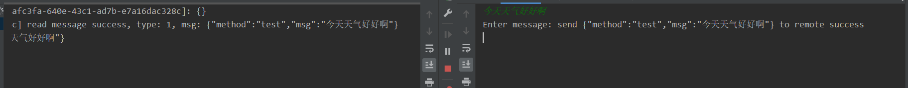
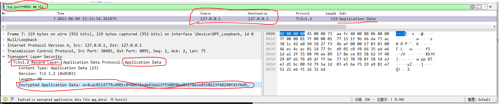

## OpenSSL 自签名证书生成过程

### 下载安装 openssl 软件

我的环境是`windows`,所以下载了一个`windows`版本的`openssl`,下载地址为: https://sourceforge.net/projects/openssl-for-windows/

下载完成后，解压，放到了`D:\\apps\\OpenSSL`目录下，该目录是`openssl.exe`的根目录。

在系统环境变量的`path`下增加地址`D:\\apps\\OpenSSL`，这样`openssl`命令就可以在任何目录下执行。
打开`cmd`,输入命令`openssl version`,输出内容即为 openssl 的版本：`OpenSSL 1.1.1h  22 Sep 2020`

### 生成过程

#### 准备好配置文件`san.cnf`

```cnf
[req]
distinguished_name = req_distinguished_name #与下方[req_distinguished_name]一致
encrypt_key = no
req_extensions = req_ext #与下方[req_ext]一致

[req_distinguished_name]
countryName = CN
countryName_default = CN
stateOrProvinceName = ZheJiang
stateOrProvinceName_default = ZheJiang
localityName = HangZhou
localityName_default = HangZhou
organizationalUnitName  = Work
organizationalUnitName_default  = Work
commonName = 127.0.0.1
commonName_max  = 64

[req_ext]
basicConstraints = CA:FALSE
keyUsage = nonRepudiation, digitalSignature, keyEncipherment
subjectAltName = @alt_names #与下方[alt_names]一致

[alt_names]
DNS.1 = localhost:18080
DNS.2 = localhost
DNS.3 = *
IP.1 = 127.0.0.1
IP.2 = 192.168.36.24
```

#### 签名文件生成

- 生成根证书私钥文件(`.key`后缀文件): `openssl genrsa -out ca.key 2048`
- 生成根证书签名请求文件(`.csr`后缀文件): `openssl req -new -key ca.key -out ca.csr -config san.cnf -extensions req_ext`
- 生成证书(`.crt`后缀文件): `openssl x509 -req -in ca.csr -signkey ca.key -out ca.crt -extfile san.cnf -extensions req_ext`

#### 服务端文件生成

- 生成服务端使用的私钥文件(`.key`后缀文件): `openssl genrsa -out server.key 2048`
- 生成服务端的签名请求文件(`.csr`后缀文件): `openssl req -new -key server.key -out server.csr -config san.cnf -extensions req_ext`
- 使用上面（根证书私钥文件+根证书签名请求文件+服务端签名请求文件）来生成服务端使用的证书(`.crt`后缀文件)：`openssl x509 -req -sha256 -extfile san.cnf -extensions req_ext -CA ca.crt -CAkey ca.key -CAcreateserial -in server.csr -out server.crt`

#### 总结

经过以上两个章节，在我们的目录下就生成了 6 个文件

- ca.key
- ca.csr
- ca.crt
- server.key
- server.csr
- server.crt

#### 命令执行过程

以下是在`Windows`上执行上述流程的一个记录

```log

F:\OpenSSL\cert>openssl genrsa -out ca.key 2048
Generating RSA private key, 2048 bit long modulus (2 primes)
..........+++++
.+++++
e is 65537 (0x010001)

F:\OpenSSL\cert>openssl req -new -key ca.key -out ca.csr -config san.cnf -extensions req_ext
You are about to be asked to enter information that will be incorporated
into your certificate request.
What you are about to enter is what is called a Distinguished Name or a DN.
There are quite a few fields but you can leave some blank
For some fields there will be a default value,
If you enter '.', the field will be left blank.
-----
CN [CN]:
ZheJiang [ZheJiang]:
HangZhou [HangZhou]:
Work [Work]:
127.0.0.1 []:

F:\OpenSSL\cert>openssl x509 -req -in ca.csr -signkey ca.key -out ca.crt -extfile san.cnf -extensions req_ext
Signature ok
subject=C = CN, ST = ZheJiang, L = HangZhou, OU = Work
Getting Private key

F:\OpenSSL\cert>openssl genrsa -out server.key 2048
Generating RSA private key, 2048 bit long modulus (2 primes)
...........+++++
....................................................+++++
e is 65537 (0x010001)

F:\OpenSSL\cert>openssl req -new -key server.key -out server.csr -config san.cnf -extensions req_ext
You are about to be asked to enter information that will be incorporated
into your certificate request.
What you are about to enter is what is called a Distinguished Name or a DN.
There are quite a few fields but you can leave some blank
For some fields there will be a default value,
If you enter '.', the field will be left blank.
-----
CN [CN]:
ZheJiang [ZheJiang]:
HangZhou [HangZhou]:
Work [Work]:
127.0.0.1 []:

F:\OpenSSL\cert>openssl x509 -req -sha256 -extfile san.cnf -extensions req_ext -CA ca.crt -CAkey ca.key -CAcreateserial -in server.csr -out server.crt
Signature ok
subject=C = CN, ST = ZheJiang, L = HangZhou, OU = Work
Getting CA Private Key
```

## 程序中如何配置

以下程序以`golang`代码为例，其他语言的实现请查阅各自的`api`文档

### 服务端程序
以下仅仅罗列出关于接收端`tls`配置的部分
```go
// 监听地址addr
listener := net.Listen("tcp4", addr) // 比如addr="127.0.0.1:8091"
// 开启TLS服务
err := http.ServeTLS(listener, nil, CertFilePath, KeyFilePath)//这里CertFilePath就取server.crt文件的路径，KeyFilePath就取server.key的路径
```

### 客户端部分程序
以下仅仅罗列出关于发送端`tls`配置的部分
```go
tlsConfig := &tls.Config{
		RootCAs:            getRootCAs(crtPath), // 客户端证书，可以取我们上面的server.crt文件的路径
		InsecureSkipVerify: false, // true表示跳过证书验证, false表示不跳过证书验证
}
dialer.TLSClientConfig = tlsConfig
// 向服务端拨号，建立连接
conn, resp, err := dialer.Dial(url, http.Header{}) // url要填入支持ssl的，比如wss或者https, url是我们外面通过参数传入进来的，比如url=wss://127.0.0.1:8091/

// getRootCAs函数的实现如下
func getRootCAs(crtPath string) *x509.CertPool {
	rootCAs := x509.NewCertPool()

	pem, err := os.ReadFile(crtPath)
	if err != nil {
		panic(err)
	}
	if !rootCAs.AppendCertsFromPEM(pem) {
		panic("Failed to load certificate")
	}
	return rootCAs
}
```

## 程序运行结果

> 左边窗口是服务端的日志窗口，右边窗口是客户端的日志窗口，可以看到消息从客户端正常发送，被服务端正常接收到。

<!-- 使用`wireshark`进行抓包，抓包结果如下：

> 可以看到在`127.0.0.1`的`8091`端口抓到了客户端发往服务端的加密数据包。 -->